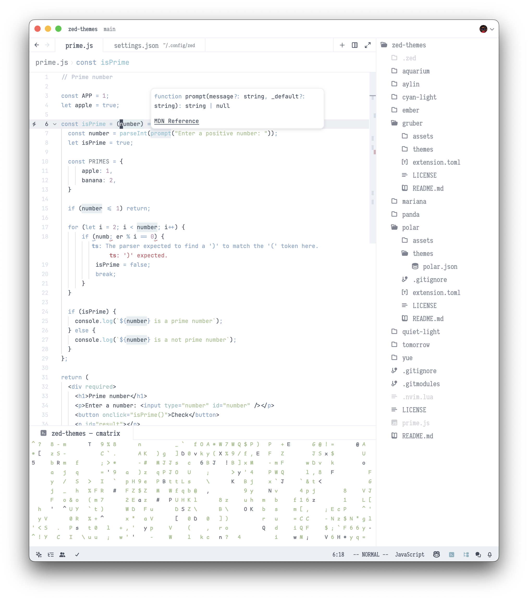

# Polar
A port of [polar](https://github.com/mtyn/polar), a pure white light version of nord

## Preview

## Installation
1. Copy polar.json to ~/.config/zed/themes/
2. Open Zed and navigate to Settings -> Theme -> Polar
